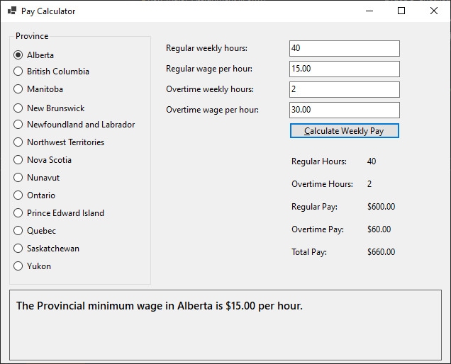
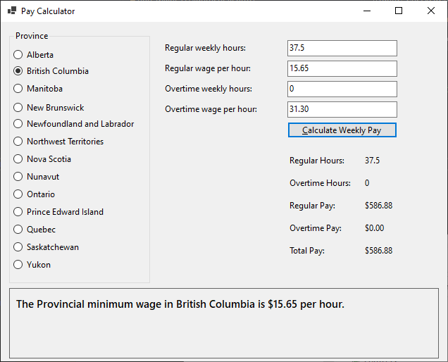

# ITEC140-A03

Note that there are no tests currently in the project, they MAY be added later.  Follow the instructions exactly to achieve the correct results.

## Mark Breakdown
- GUI [5]
- Variable Declarations [5]
- Comments [2.5]
- Calculate Button Functionality / Error Handling [5]
- Radio Button Functionality [5]
- String Formatting [2.5] 
- (Optional) Project the earnings the person will accumulate over a year (52 weeks) [No marks]
- (Optional) Calculate the income tax that will be deducted, federally and by province [No marks]

Your application should use radio buttons to select a province, when a province is selected the minimum wage for that province should be loaded in to the corresponding textbox.

When each radio button is clicked the appropriate variables should be given wage values and a label at the bottom should display a message like: "Minimum wage in province is: $x.xx", you should try and store the wage as a global variable, not locally to each event/code block

You can use this link for wage reference:  https://en.wikipedia.org/wiki/Minimum_wage_in_Canada

The user will enter the regular hours they worked, and also the overtime hours they worked.  Users can also type in their own wages instead of having them load on radio button click.  A standard work week usually has 40 hours of regular work, and any hours over 40 are considered overtime hours.  It is up to the user to enter these hours correctly.

When an exception occurs the user should be given a MessageBox pop up to tell them something went wrong.

When clicking on the radio buttons, the regular wage should be loaded into the regular wage textbox, and the overtime wage should be loaded into the overtime wage textbox. (Overtime wage = Regular wage x 2)

Values should be displayed in labels with the correct ToString() formatting:
- Money: .ToString("C")
- Numbers: .ToString("N")

When the calculate button is clicked the calculator should display:

- Regular Hours
- Overtime Hours
- Regular Pay
- Overtime Pay
- Total Pay

Once complete the application should look similar to this:

## Hand-In
Please download the finished code from Github and upload it to Blackboard before the due date.

 
## Expectations
This assignment should be completed individually, please ask your instructor for clarification where needed.  Receiving help or feedback from classmates is okay, but do not share or copy any materials that will be added to the assignment submission.  Help your classmates learn to program but, do not share code/files.  Any code that you find on the internet can be referenced in comments, where necessary.
